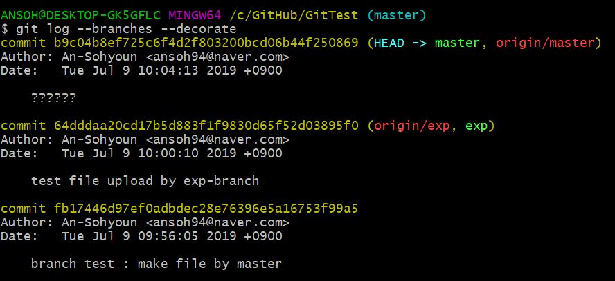
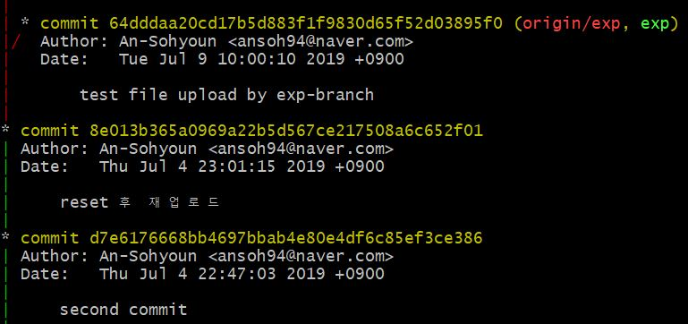
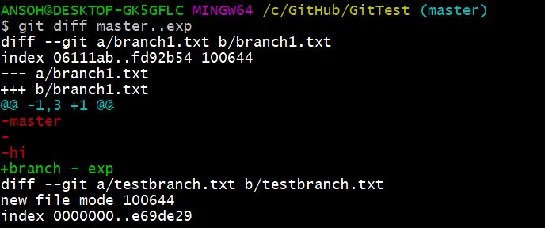

> week2 학습 내용 : branch 생성 및 활용

### 1-1. branch 소개

- '**branch**'는 '나무의 가지'에서 유래한 말로 하나의 Repository를 여러 사람 혹은 여러 용도로 관리할 경우 사용
- Repository 생성 시 기본적으로 'master'라는 branch가 생성이 되며 작업에 따라 분기 가능 
- branch를 통하여 효율적인 관리가 가능

### 1-2. branch 만들기

- branch 생성하기 

> 생성된 branch를 삭제할 때는 `git branch -d exp` 이용

- 현재 접속 된 branch  확인

> '*' 표시를 통하여 현재 접속 된 branch를 나타냄

- branch 전환하기

- 서로 다른 branch로 접속하여 확인

> master와 exp라는 branch로 'branch1.txt'에 데이터를 입력하였지만 서로 조회 할 수 없음

### 1-3. branch 정보 확인

- branch의 commit log 확인 : `git log --branches --decorate`

> HEAD에서 현재 접속 된 branch 표시

- graph를 통하여 log를 그래프로 보기 좋게 표시 : `git log --branches --decorate --graph`

> `git log` : 현재 branch의 commit log만 보여줌
>
> `git log --branches --decorate` : 현재 branch를 포함하여 모든  commit log를 보여줌 

- branch 간 log 비교하기 : `git log master..exp` 

> master에는 없고 exp에만 있는 것 보여줌

- branch의 현재 상태 모두 보여줌 : `git diff master..exp` → branch 간 코드 비교

### 1-4. branch 병합

- merge : 두 개의 branch로 만들어진 데이터를 하나로 합침 → `git merge B` 사용

  [ 예시 ] A branch를 B branch로 병합할 때 (A ← B) :

  `git checkout A`

  `git merge B`

### 1-5. branch 수련

 

참고사이트 : https://opentutorials.org/course/2708 (지옥에서 온 Git)

